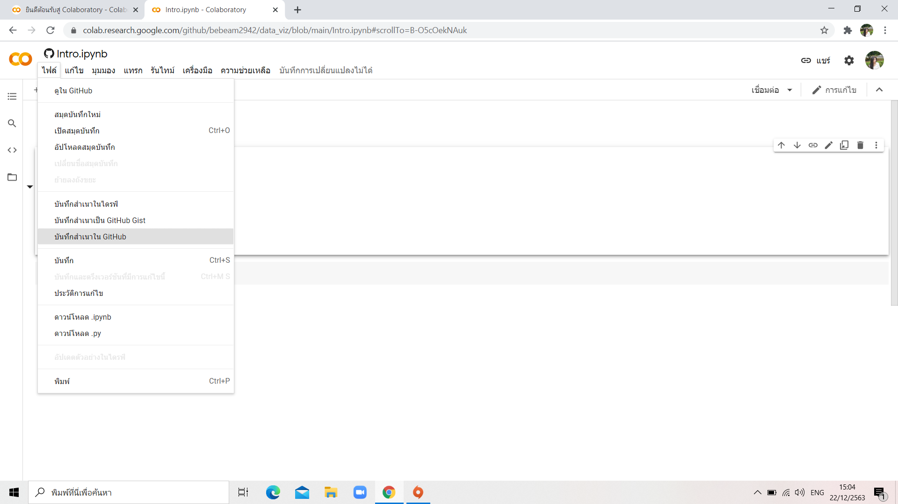
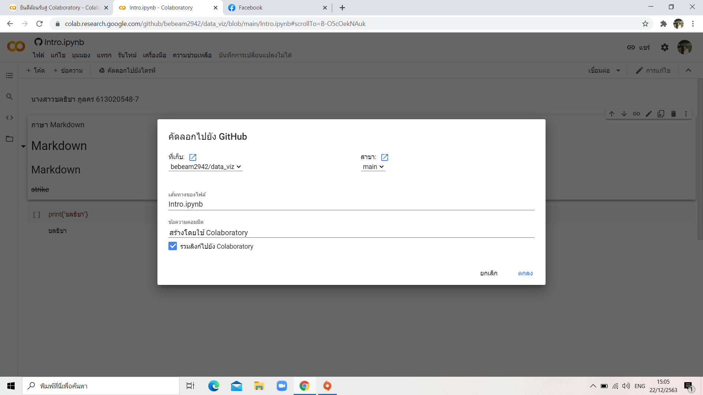
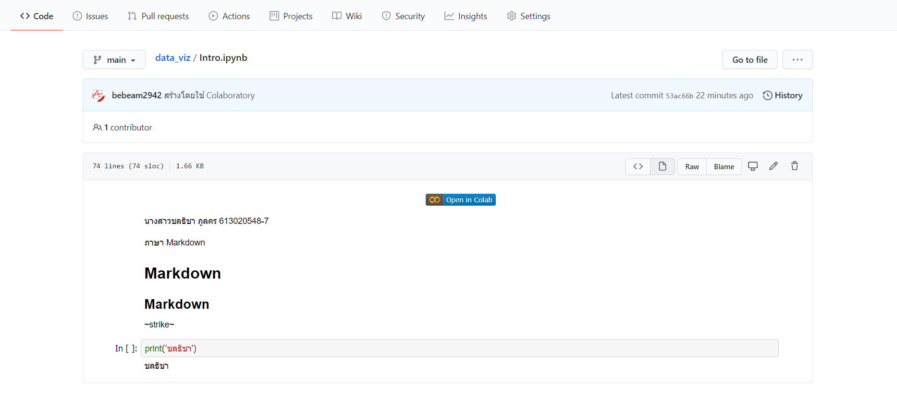

# data_viz
ชลธิชา ภูลคร 613020548-7

insert image

# ขั้นตอนการ Save file จาก Colab ไปยัง Github

## 1.เลือกไฟล์ที่ต้องการจะบันทึกไปยัง github จากนั้นเลือกไฟล์และกด บันทึกสำเนาในgithub

## 2.เมื่อกดบันทึกสำเนา github แล้วขึ้นแท็บ คักลอกไปยัง Github จากนั้นจึงกดตกลง

## 3. เมื่อกดบันทึกมาแล้วจะได้หน้าต่างที่มายัง github และเป็นไฟล์ที่ถูกบันทึกมาจาก Colab

